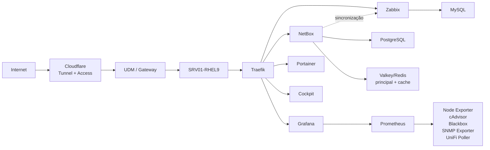

# Infrastructure Operations Platform

> **Production-grade reference architecture for infrastructure operations, observability, service exposure, asset management and operational governance.**


[](https://github.com/marcosantoniotic/infrastructure-operations-platform/actions/workflows/validation.yml)

Plataforma profissional de operações de infraestrutura criada para demonstrar, validar e documentar práticas aplicáveis a ambientes corporativos. O projeto integra inventário técnico, proxy reverso, Zero Trust, observabilidade, monitoramento, gestão de containers, automação e governança operacional em uma arquitetura coesa.

A implementação física funciona como ambiente de validação técnica contínua das ferramentas utilizadas no dia a dia profissional. O foco do projeto não é o local onde executa, mas a qualidade de engenharia: isolamento, segurança, rastreabilidade, recuperação, documentação e decisões arquiteturais reproduzíveis.

> Este repositório foi preparado para publicação. Endereços, domínios, identificadores de conta, credenciais e tokens reais não fazem parte do conteúdo versionado.

## Executive overview

O projeto resolve cinco desafios comuns de operações:

1. consolidar a fonte de verdade de ativos e endereçamento;
2. publicar aplicações com TLS, identidade e políticas uniformes;
3. combinar monitoramento orientado a eventos com métricas de alta resolução;
4. operar workloads containerizados sem expor bancos e caches;
5. transformar conhecimento operacional em documentação, runbooks e decisões auditáveis.

## Competências demonstradas

- arquitetura Linux e administração RHEL;
- Docker, Compose, redes, volumes e ciclo de vida;
- reverse proxy, TLS, DNS e Cloudflare Zero Trust;
- Zabbix, Prometheus, Grafana e exporters;
- NetBox como fonte de verdade DCIM/IPAM;
- integração NetBox–Zabbix;
- monitoração de UniFi/UDM e MikroTik;
- hardening, gestão de segredos e segmentação;
- backup, disaster recovery e resposta a incidentes;
- documentação arquitetural, ADRs e gestão de mudanças.

## Technology stack

| Camada | Solução | Função |
|---|---|---|
| Sistema operacional | Red Hat Enterprise Linux 9 | Host da plataforma |
| Runtime | Docker Engine + Compose | Execução e ciclo de vida dos serviços |
| Entrada | Traefik | Proxy reverso, TLS e middlewares |
| Borda | Cloudflare Tunnel + Access | Publicação e controle de identidade |
| Inventário | NetBox | DCIM, IPAM e fonte de verdade |
| Monitoramento | Zabbix + Agent 2 | Eventos, triggers, mapas e disponibilidade |
| Métricas | Prometheus | Coleta e retenção de séries temporais |
| Visualização | Grafana | Dashboards consolidados |
| Administração | Portainer + Cockpit | Containers e sistema operacional |
| Rede | UniFi/UDM + MikroTik | Gateway e roteamento monitorados |

## Architecture at a glance



## Engineering principles

- NetBox é a fonte de verdade para ativos e endereçamento.
- Zabbix é responsável por estado, eventos, triggers e mapas.
- Prometheus armazena métricas de alta cardinalidade e séries temporais.
- Grafana entrega a visão operacional consolidada.
- Traefik é o único ponto de entrada HTTP/HTTPS no host.
- Cloudflare Access protege aplicações publicadas.
- Bancos, caches e exporters permanecem em redes internas.
- Segredos são fornecidos por arquivos ou variáveis externas ao Git.
- Mudanças preservam rollback e são validadas antes da promoção.

## Technical highlights

- cinco projetos Compose independentes por domínio funcional;
- 19 containers em execução na baseline documentada;
- entrada HTTP/HTTPS centralizada no Traefik;
- Docker Socket protegido por proxy restrito;
- acesso externo condicionado por identidade;
- acesso local preservado por DNS dividido;
- bancos e caches isolados em redes internas;
- monitoramento de host, containers, aplicações, certificados e rede;
- mapa Zabbix completo com triggers reais;
- dashboard executivo do ecossistema no Grafana;
- sincronização controlada entre NetBox e Zabbix;
- exemplos públicos completamente sanitizados.

## Documentation map

- [Visão geral da arquitetura](docs/architecture/overview.md)
- [Estudo de caso para portfólio](docs/portfolio-case-study.md)
- [Dependências dos serviços](docs/architecture/service-dependencies.md)
- [Redes e fluxos](docs/architecture/networking.md)
- [Inventário atual](docs/inventory/current-state.md)
- [Referência de configuração](docs/configuration-reference.md)
- [Catálogo de módulos executáveis](docs/modules.md)
- [Inventários e gestão de segredos](docs/secrets-and-inventories.md)
- [Gestão de mudanças](docs/change-management.md)
- [Ambiente de validação como código](docs/testing/validation-environment.md)
- [Observabilidade](docs/observability.md)
- [Segurança](docs/security.md)
- [Operação diária](docs/runbooks/daily-operations.md)
- [Inicialização e desligamento](docs/runbooks/startup-shutdown.md)
- [Backup e restauração](docs/runbooks/backup-restore.md)
- [Objetivos de confiabilidade, RPO, RTO e retenção](docs/reliability-objectives.md)
- [Resposta a incidentes](docs/runbooks/incident-response.md)
- [Gestão de mudanças](docs/runbooks/change-management.md)
- [Publicação segura](docs/publishing-checklist.md)
- [Roadmap](docs/roadmap.md)
- [Fase futura: GLPI](docs/glpi-phase.md)

## Repository structure

```text
.
├── inventories/         # exemplos públicos e ambientes ignorados
├── automation/          # Packer, Kickstart, Vagrant e scripts de validação
├── playbooks/           # pontos de entrada independentes
├── roles/               # módulos Ansible idempotentes
├── config/              # exemplos sanitizados e convenções
├── docs/
│   ├── architecture/    # arquitetura e fluxos
│   ├── decisions/       # registros de decisão arquitetural
│   ├── inventory/       # estado conhecido da plataforma
│   └── runbooks/        # procedimentos operacionais
├── inventory/           # catálogo legível por máquinas
└── scripts/             # validações sem segredos
```

## Modular deployment

A plataforma pode ser implantada integralmente ou por componente:

```bash
# Pré-requisitos
ansible-galaxy collection install -r requirements.yml

# Validação do host
ansible-playbook -i inventories/validation/hosts.yml playbooks/preflight.yml

# Baseline RHEL
ansible-playbook -i inventories/validation/hosts.yml playbooks/bootstrap-rhel.yml

# Docker Engine
ansible-playbook -i inventories/validation/hosts.yml playbooks/docker.yml

# Somente NetBox e suas dependências
ansible-playbook -i inventories/validation/hosts.yml playbooks/netbox.yml

# Somente Zabbix Server, frontend e MySQL
ansible-playbook -i inventories/validation/hosts.yml playbooks/zabbix.yml

# Backup consistente e restauração isolada do Zabbix
ansible-playbook -i inventories/validation/hosts.yml playbooks/zabbix-backup.yml

# Somente Portainer
ansible-playbook -i inventories/validation/hosts.yml playbooks/portainer.yml

# Prometheus, Grafana e exporters do host
ansible-playbook -i inventories/validation/hosts.yml playbooks/observability.yml
ansible-playbook -i inventories/validation/hosts.yml playbooks/cockpit.yml

# Baseline inicial completa
ansible-playbook -i inventories/validation/hosts.yml playbooks/platform.yml
```

Consulte o [catálogo de módulos](docs/modules.md), o [guia do módulo NetBox](roles/netbox/README.md), a [gestão de segredos](docs/secrets-and-inventories.md) e o [plano de validação do ambiente](docs/testing/environment-validation-plan.md).

## Project evolution

O GLPI será tratado como fase própria. Sua inclusão deverá respeitar o mesmo modelo de proxy, identidade, observabilidade, backup e isolamento de dados, sem sobrepor o papel do NetBox. Consulte [Fase futura: GLPI](docs/glpi-phase.md).

As próximas evoluções priorizam backup comprovado, automação de validações, rotação de segredos, CI para configurações e testes formais de recuperação.

## Professional positioning

Este repositório apresenta uma implementação real e funcional, não apenas um diagrama conceitual. Ele documenta decisões, dependências, riscos conhecidos, controles implantados e lacunas ainda em tratamento — abordagem essencial para demonstrar maturidade operacional e não apenas instalação de ferramentas.
