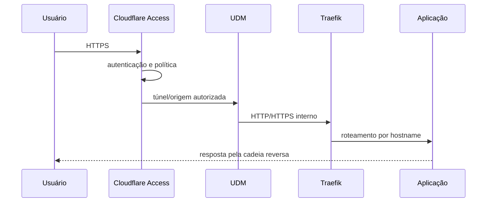

# Redes e fluxos

## Zonas lógicas

| Zona | Conteúdo | Exposição |
|---|---|---|
| Borda | Cloudflare Tunnel e Access | Internet |
| LAN de gestão | administração e acesso local | redes autorizadas |
| Produção | origem do túnel e aplicações | redes autorizadas |
| Proxy Docker | Traefik e frontends | interna ao Docker |
| Backend Zabbix | Zabbix Server e MySQL | interna ao Docker |
| Backend NetBox | NetBox, PostgreSQL e Valkey | interna ao Docker |
| Observabilidade | Prometheus, Grafana e exporters | interna ao Docker |
| Socket proxy | Traefik e proxy do Docker API | interna e restrita |

Os endereços reais são fornecidos por configuração externa:

```text
<LAN_IP>
<PRODUCTION_IP>
<UDM_IP>
<MIKROTIK_IP>
<BASE_DOMAIN>
```

## Fluxo externo



## Acesso local sem Internet

O DNS interno deve resolver os nomes das aplicações diretamente para um endereço do Traefik. O navegador continua usando os mesmos nomes e certificados, mas não depende do caminho externo.

Não se recomenda distribuir dois registros A simultâneos para interfaces do mesmo host como mecanismo de alta disponibilidade. Isso é round-robin DNS, não balanceamento com verificação de saúde.

## Regras de publicação

- somente Traefik publica HTTP/HTTPS;
- bancos e caches não publicam portas no host;
- Prometheus pode ser limitado a loopback para diagnóstico;
- Cockpit é acessado pelo proxy, mesmo quando escuta no host;
- a porta do Zabbix Server só deve permanecer publicada quando houver agentes externos que realmente precisem dela;
- SSH deve permanecer limitado às redes administrativas.

## Redes Docker

As redes são nomeadas por função, não por produto consumidor. Serviços podem participar de mais de uma rede apenas quando a integração exigir. Exemplo: o Zabbix Server participa das redes necessárias para testar diretamente bancos e aplicações, sem expô-los.
