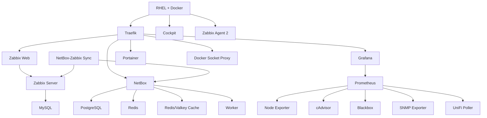

# Dependências dos serviços

## Grafo de dependências

## Ordem recomendada de recuperação

1. RHEL, armazenamento, rede e Docker.
2. Traefik e Docker Socket Proxy.
3. Bancos e caches.
4. Zabbix e NetBox.
5. Prometheus e Grafana.
6. Portainer e integrações auxiliares.
7. Validação de Cloudflare, DNS e acesso local.

## Falhas em cascata

| Falha | Impacto esperado |
|---|---|
| Traefik | aplicações indisponíveis por nome, mesmo com containers ativos |
| MySQL | Zabbix sem persistência operacional |
| PostgreSQL | NetBox indisponível |
| Valkey/Redis | filas, cache ou worker do NetBox degradados |
| Prometheus | dashboards de métricas sem dados novos |
| Grafana | métricas continuam coletadas, mas sem visualização |
| Cloudflare | acesso externo indisponível; acesso local deve permanecer |
| UDM | indisponibilidade de rede e DNS local |
| SRV01 | indisponibilidade total da plataforma |
