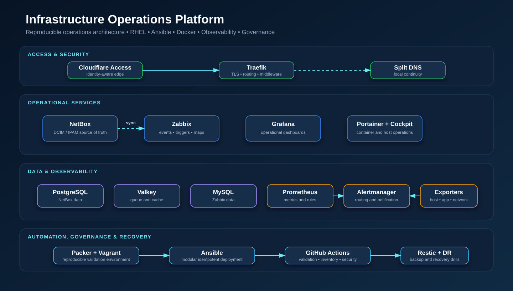
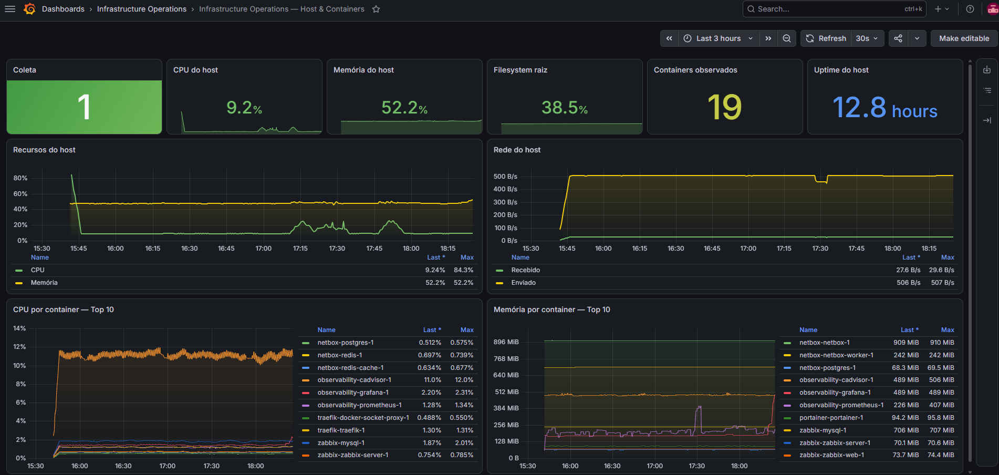
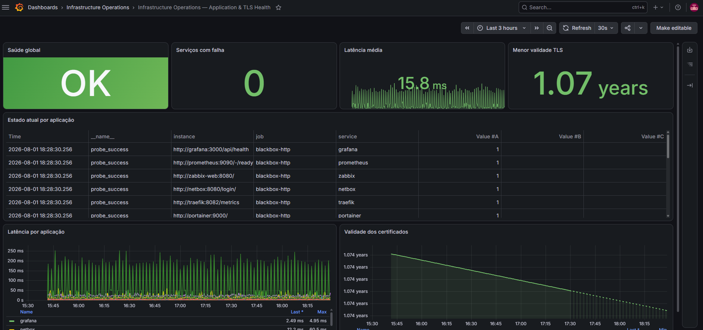
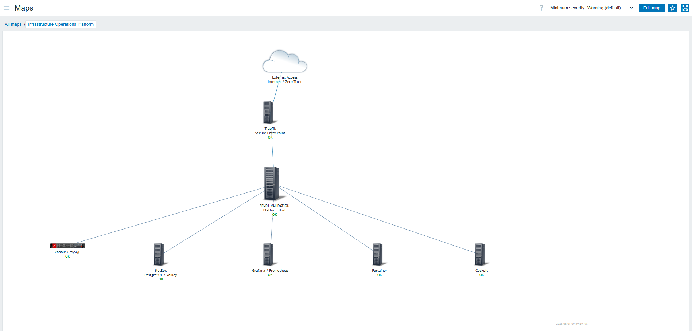
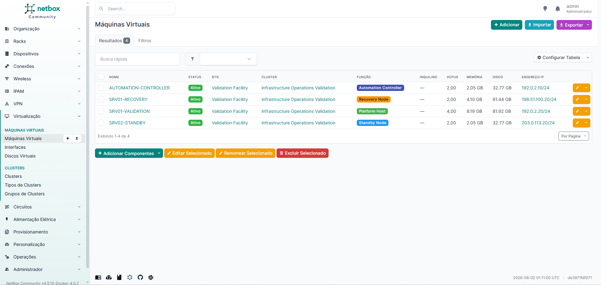
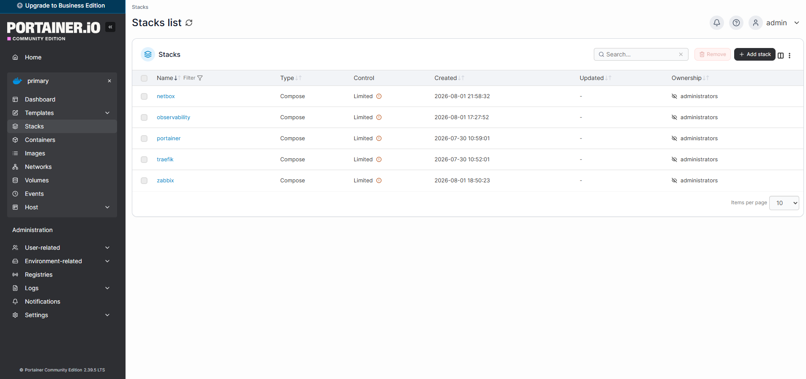
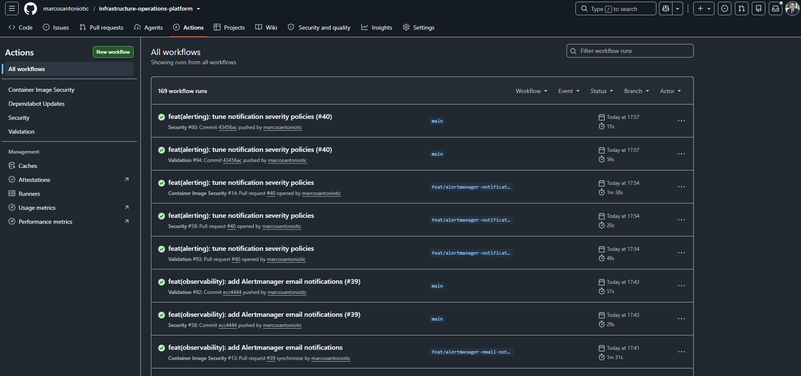
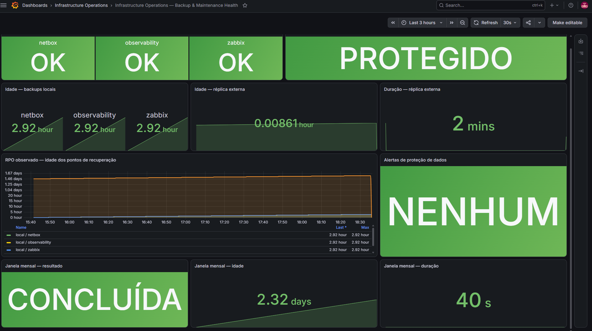

# Resultados e evidências

Este diretório reúne provas sanitizadas da plataforma de validação. O objetivo
é permitir uma leitura rápida por recrutadores e uma verificação técnica mais
profunda por engenheiros, sem publicar endereços, credenciais, identificadores
de conta, inventário real ou dados de terceiros.

## Evidências disponíveis

| Evidência | O que comprova | Prova atual |
|---|---|---|
| Arquitetura | separação de responsabilidades e fluxos | [diagrama sanitizado](assets/architecture-overview.svg) |
| Infraestrutura como código | construção reproduzível e implantação modular | [Packer](../../automation/packer/), [Vagrant](../../automation/vagrant/), [playbooks](../../playbooks/) |
| CI | validação estrutural, PowerShell, Ansible, Compose, Prometheus e segurança | [workflow de validação](../../.github/workflows/validation.yml) e [segurança de imagens](../../.github/workflows/image-security.yml) |
| Observabilidade | dashboards provisionados e alertas versionados | [role de observabilidade](../../roles/observability/) |
| Backup e restauração | backup consistente, réplica criptografada e testes isolados | [runbook](../runbooks/backup-restore.md) e [objetivos de confiabilidade](../reliability-objectives.md) |
| Governança | ADRs, catálogo de credenciais e runbooks | [decisões](../decisions/) e [catálogo](../../config/credential-catalog.json) |

## Capturas operacionais

As capturas abaixo compõem o pacote visual aprovado para publicação no
portfólio. Elas foram geradas no ambiente funcional de validação e revisadas
conforme o [guia de captura](capture-guide.md):

| Arquivo | Conteúdo esperado | Estado |
|---|---|---|
| [`grafana-platform-overview.png`](grafana-platform-overview.png) | visão de host, containers e serviços | disponível e revisada |
| [`grafana-application-tls-health.png`](grafana-application-tls-health.png) | disponibilidade, latência e validade TLS das aplicações | disponível e revisada |
| [`zabbix-ecosystem-map.png`](zabbix-ecosystem-map.png) | mapa do ecossistema com estados funcionais | disponível e revisada |
| [`netbox-inventory.png`](netbox-inventory.png) | inventário demonstrativo sem ativos reais | disponível e revisada |
| [`portainer-stacks.png`](portainer-stacks.png) | stacks organizadas por domínio | disponível e revisada |
| [`backup-restore-validation.png`](backup-restore-validation.png) | backups locais, réplica externa e janela de recuperação | disponível e revisada |
| [`github-actions-validation.png`](github-actions-validation.png) | pipelines de validação e segurança concluídos com sucesso | disponível e revisada |

Novas capturas não devem ser substituídas por imagens simuladas. A credibilidade
do pacote depende de representar somente estados realmente observados.

### Grafana — host e containers

### Grafana — aplicações e TLS

### Zabbix — mapa do ecossistema

### NetBox — inventário demonstrativo

### Portainer — stacks da plataforma

### GitHub Actions — validação e segurança

### Continuidade — backup e réplica externa

## Matriz de comprovação

Consulte a [matriz requisito–implementação–prova](evidence-matrix.md) para a
ligação objetiva entre competências, código e evidências.
