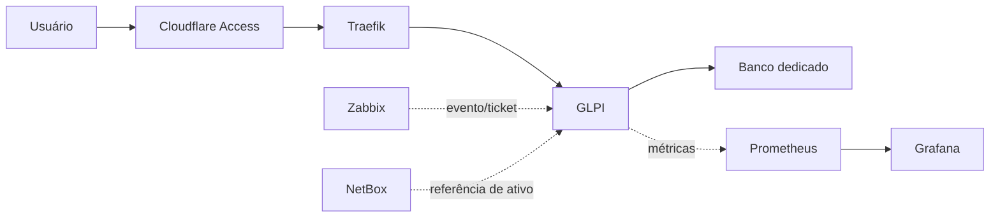

# Fase futura: GLPI

## Objetivo

Adicionar service desk, catálogo de serviços, chamados, contratos e fluxo de ativos de suporte sem substituir o NetBox como fonte de verdade de rede e datacenter.

## Divisão de responsabilidade

| Domínio | Autoridade proposta |
|---|---|
| DCIM, IPAM, interfaces e cabos | NetBox |
| Estado, disponibilidade e eventos | Zabbix |
| Métricas e dashboards | Prometheus/Grafana |
| Chamados, SLA e atendimento | GLPI |
| Identidade de acesso externo | Cloudflare Access |

## Arquitetura proposta

## Requisitos antes da implantação

- backup atual do ecossistema comprovado;
- capacidade de memória e armazenamento revisada;
- banco dedicado e versão suportada;
- nomes DNS interno e externo definidos;
- política Cloudflare Access definida;
- volumes e rede Docker próprios;
- integração com e-mail armazenada como segredo;
- política de atualização e rollback;
- alertas de aplicação, banco e certificado;
- runbook de restauração.

## Integrações

### Zabbix → GLPI

Uso recomendado:

- abertura de ticket para incidentes qualificados;
- atualização e fechamento por recuperação;
- correlação por ID do evento;
- prevenção de tickets duplicados;
- severidade mapeada para prioridade.

### NetBox ↔ GLPI

Evitar sincronização bidirecional irrestrita. Definir campos mestres:

- NetBox: serial técnico, interface, endereço, rack e relação física;
- GLPI: usuário, contrato, chamado, garantia e ciclo de atendimento.

## Critérios de aceite

- login protegido;
- criação e fechamento de chamado;
- backup e restauração do banco;
- métricas e logs visíveis;
- alerta Zabbix abrindo ticket de teste;
- ativo referenciado sem duplicação;
- acesso local preservado sem Internet.
