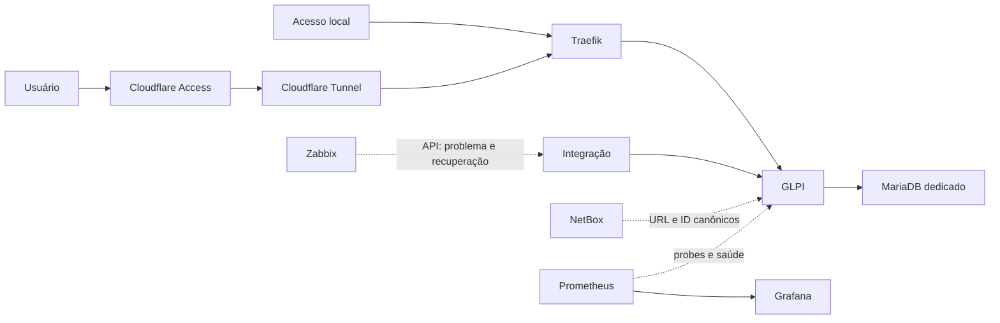

# Fase 4: GLPI

## Estado

A baseline funcional e arquitetural está definida, o módulo reproduzível foi
implementado e a implantação isolada foi certificada com HTTPS, autenticação,
reinício, restauração e segunda convergência sem mudanças. A integração
Zabbix-GLPI e a referência canônica ao NetBox também foram certificadas. A
operação final de dashboards e runbooks permanece no Gate G6 e é acompanhada
separadamente no [roadmap](roadmap.md).

A execução sanitizada está registrada em
[GLPI laboratory validation evidence](testing/glpi-validation-evidence.md) e
[GLPI integrations validation evidence](testing/glpi-integrations-validation-evidence.md).

## Objetivo

Adicionar service desk, catálogo de serviços, chamados, contratos e fluxo de
ativos de suporte sem substituir o NetBox como fonte de verdade de rede e
datacenter.

## Escopo funcional inicial

- abertura, classificação, atribuição, acompanhamento, solução e fechamento de
  chamados;
- portal de autosserviço e catálogo inicial de solicitações;
- prioridades, SLA, notificações e histórico de atendimento;
- base de conhecimento para procedimentos recorrentes;
- cadastro de fornecedores, contratos, garantias e vínculos de suporte;
- abertura e atualização automática de tickets para eventos qualificados do
  Zabbix;
- referência navegável ao objeto técnico correspondente no NetBox;
- trilha de auditoria das ações administrativas e das integrações.

## Fora do escopo inicial

- substituir DCIM, IPAM, interfaces, cabos ou localização física do NetBox;
- sincronização bidirecional irrestrita de ativos;
- descoberta de endpoints ou implantação ampla do GLPI Agent;
- alta disponibilidade ativa-ativa do GLPI ou do banco;
- atualização automática da aplicação ou do schema ao reiniciar containers;
- importação de dados específica de um ambiente legado.

Migrações de dados reais serão tratadas por runbook operacional privado. O
projeto público conterá apenas mecanismos genéricos, validáveis e sem dados do
ambiente.

## Divisão de responsabilidade

| Domínio | Autoridade |
|---|---|
| DCIM, IPAM, interfaces, cabos e posição física | NetBox |
| Estado, disponibilidade e eventos | Zabbix |
| Métricas, alertas técnicos e dashboards | Prometheus/Grafana |
| Chamados, SLA, atendimento, contratos e garantia | GLPI |
| Identidade de acesso externo | Cloudflare Access |

Consulte também a decisão
[ADR-006](decisions/ADR-006-glpi-boundary-and-platform.md).

## Baseline técnica

| Componente | Decisão inicial |
|---|---|
| Aplicação | imagem oficial `glpi/glpi:11.0.8` |
| Banco | MariaDB `11.8.8`, instância dedicada |
| Diretório remoto | `/opt/glpi` |
| Porta local de contingência | `127.0.0.1:8083` |
| Rota interna | `glpi.ops.<BASE_DOMAIN>` |
| Rota externa opcional | `glpi-ops.<BASE_DOMAIN>` |
| Rede de entrada | `traefik_proxy`, somente no container GLPI |
| Rede de dados | rede Docker interna exclusiva do módulo |

As versões são fixadas e atualizadas por mudança revisada. Antes de qualquer
upgrade, a automação deverá criar ponto de recuperação, validar compatibilidade
e executar a migração de schema como etapa explícita. O container não poderá
atualizar a aplicação automaticamente durante um reinício normal.

O MariaDB 11.8 foi escolhido por ser LTS, atender ao mínimo do GLPI 11 e evitar
a limitação de datas anterior ao MariaDB 11.5. A versão deverá ser revista antes
do fim da manutenção Community em 2028.

## Arquitetura

O banco não publica portas no host nem participa da rede do Traefik. Somente o
GLPI acessa simultaneamente a rede de entrada e a rede interna de dados. A porta
HTTP ligada ao loopback serve para validação de saúde. O acesso autenticado
local usa o Traefik HTTPS, inclusive por túnel SSH, e permanece independente do
Cloudflare e do DNS externo.

## Persistência e banco

Os seguintes dados devem sobreviver à recriação dos containers:

- banco MariaDB completo;
- `/var/glpi/config`;
- `/var/glpi/files`;
- `/var/glpi/logs`;
- `/var/glpi/marketplace`.

A chave `glpicrypt.key`, armazenada na configuração do GLPI, é parte obrigatória
de todo ponto de recuperação. O usuário da aplicação terá acesso somente ao
banco do GLPI. As tabelas de fuso horário do MariaDB serão inicializadas e a
permissão adicional, se exigida pela versão efetivamente implantada, será
limitada a leitura.

## Backup e restauração

O módulo seguirá RPO de 24 horas e RTO de 4 horas. Cada conjunto de backup deve
conter:

1. dump consistente do MariaDB;
2. os quatro caminhos persistentes do GLPI;
3. `glpicrypt.key`, com verificação explícita de presença;
4. manifesto SHA-256, versão das imagens e metadados do conjunto;
5. resultado sanitizado da execução.

O backup local diário terá retenção de 14 dias e será replicado para o
repositório externo criptografado já adotado pela plataforma. A restauração
isolada mensal deverá validar schema, autenticação, anexos, chave criptográfica,
fila de ações automáticas e resposta HTTP. A existência de arquivos, sem
restauração funcional, não comprova o RPO.

## Segurança

- credenciais de banco, conta administrativa, SMTP, API e OAuth ficam somente
  no Ansible Vault ou no mecanismo de segredos aprovado;
- a rota externa só é criada depois da política Cloudflare Access;
- o acesso interno usa HTTPS pelo Traefik e mantém fallback local independente;
- contas padrão são removidas ou desativadas após o bootstrap;
- contas humanas administrativas usam segundo fator quando suportado;
- cada integração usa uma conta técnica própria e privilégio mínimo;
- banco e endpoints administrativos não são publicados diretamente;
- cookies seguros, `HttpOnly` e `SameSite` são validados atrás do proxy;
- logs e evidências não podem expor tokens, senhas, cookies ou dados pessoais.

## Integração Zabbix → GLPI

A integração usará a API de alto nível suportada pelo GLPI 11 e uma conta
técnica exclusiva. O fluxo mínimo será:

1. o Zabbix envia somente eventos elegíveis ao componente de integração;
2. o `eventid` do problema é usado como chave externa idempotente;
3. severidade, host, item, horário e URL do evento são normalizados;
4. um problema abre um único ticket ou atualiza o ticket correlacionado;
5. a recuperação adiciona acompanhamento e encerra o ticket conforme política;
6. tentativas, falhas e latência ficam observáveis sem registrar credenciais.

O primeiro incremento poderá usar um webhook com armazenamento mínimo de
correlação. A integração deve suportar repetição segura: reenviar o mesmo evento
não pode criar um segundo chamado.

## Integração NetBox → GLPI

O GLPI armazenará apenas a referência necessária ao atendimento, como URL
canônica, tipo do objeto e ID do NetBox. Nome, serial, rack, interfaces,
endereços e cabeamento continuam sob autoridade do NetBox.

Uma futura importação unidirecional poderá copiar campos de exibição, mas deverá
ser reexecutável e nunca alterar a fonte técnica no NetBox a partir do GLPI. O
aceite inicial exige navegação do ticket para o objeto, não uma cópia completa
do inventário.

## Observabilidade

O módulo deverá expor evidência para:

- disponibilidade HTTP interna e externa;
- saúde do container e conexão com o banco;
- execução das ações automáticas do GLPI;
- idade, resultado e duração do backup;
- falhas e duplicidades da integração Zabbix;
- validade TLS da rota publicada;
- capacidade dos volumes e crescimento do banco.

Dashboards devem diferenciar ausência de dados, falha da coleta e falha real da
aplicação.

## Etapas e gates

| Gate | Evidência exigida |
|---|---|
| G0 — requisitos | este documento e ADR aprovados no Git |
| G1 — pré-flight | capacidade, DNS, portas e segredos validados |
| G2 — implantação | Compose válido, imagens fixadas e serviços saudáveis |
| G3 — acesso | login local, Traefik e Access testados |
| G4 — proteção | backup criado e restauração isolada aprovada |
| G5 — integrações | evento Zabbix idempotente e referência NetBox válidos |
| G6 — operação | métricas, alertas, atualização, rollback e runbooks válidos |

Estado de validação em 2026-08-17: G0 a G5 aprovados no laboratório isolado;
G6 permanece aberto.

## Critérios de aceite da fase

- login protegido e conta administrativa individual;
- criação, atribuição, acompanhamento e fechamento de chamado;
- catálogo básico e notificação por e-mail;
- backup e restauração funcional do banco, anexos e chave;
- métricas, logs e alertas visíveis;
- alerta Zabbix abrindo um único ticket de teste e atualizando-o na recuperação;
- ativo referenciado por URL/ID sem duplicar a autoridade do NetBox;
- acesso local preservado sem Internet;
- atualização e rollback executados em validação antes da produção;
- runbooks e evidências sanitizadas publicados.

## Referências técnicas

- [Imagem Docker oficial do GLPI](https://github.com/glpi-project/docker-images)
- [Requisitos de instalação do GLPI](https://glpi-install.readthedocs.io/en/latest/prerequisites.html)
- [API REST de alto nível do GLPI](https://help.glpi-project.org/documentation/modules/configuration/general/api/restful-api-v2)
- [Documentação de webhooks do GLPI](https://help.glpi-project.org/documentation/modules/configuration/webhook)
- [Ciclo de manutenção do MariaDB](https://mariadb.org/about/#maintenance-policy)
