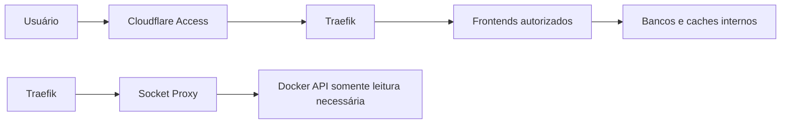

# Arquitetura de segurança

## Controles implementados

### Borda

- Cloudflare Access antes das aplicações publicadas;
- túnel sem necessidade de exposição direta do serviço à Internet;
- TLS no Traefik;
- DNS dividido para acesso local e externo pelos mesmos nomes.

### Proxy

- Traefik com descoberta Docker;
- acesso ao Docker API por socket proxy restrito;
- `exposedByDefault=false`;
- middlewares padronizados de cabeçalhos;
- painel do Traefik protegido como qualquer outra aplicação.

### Host

- firewalld ativo;
- SSH como serviço administrativo;
- Cockpit roteado pelo proxy;
- segredos em arquivos com acesso restrito;
- atualizações e janelas de manutenção documentadas.

### Containers

- redes separadas por domínio;
- bancos e caches sem bind público;
- volumes dedicados;
- imagens versionadas;
- `no-new-privileges` quando compatível;
- serviços administrativos protegidos por identidade.

## Modelo de confiança

## Segredos

Segredos reais devem ficar em um gerenciador como 1Password e ser materializados no host apenas quando necessários. O Git armazena somente o nome da variável ou o caminho esperado.

Permissões mínimas esperadas:

| Tipo | Permissão recomendada |
|---|---|
| token/arquivo `.env` | `0600` |
| estado ACME | `0600` |
| senha consumida como Docker secret | `0400` ou `0600` |
| configuração pública | `0644` |

## Riscos conhecidos

- nó único sem alta disponibilidade;
- porta do Zabbix Server publicada no host;
- cAdvisor exige acesso privilegiado para visibilidade completa;
- participação do Zabbix Server em várias redes aumenta seu alcance lateral;
- backups ainda não comprovados por timer e teste de restauração;
- Portainer e Cockpit são superfícies administrativas de alto impacto.

## Mitigações prioritárias

1. automatizar e monitorar backups;
2. testar restauração isolada;
3. limitar origens da porta do Zabbix Server;
4. revisar permissões de tokens a cada fase;
5. adicionar alertas de segurança e auditoria;
6. registrar dependências e versões em cada mudança.
