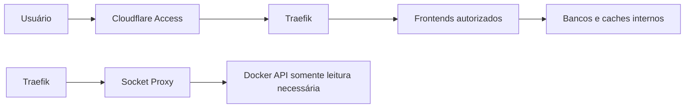

# Arquitetura de segurança

## Verificação contínua

O GitHub Actions executa o Trivy em pull requests e semanalmente para detectar
vulnerabilidades altas ou críticas, segredos expostos e configurações
inseguras. A action utiliza um commit imutável, e um achado bloqueia o workflow
até ser corrigido ou registrado formalmente como exceção aceita.

Um segundo workflow monta automaticamente a matriz de imagens fixadas nos
defaults Ansible e executa uma análise Trivy de cada imagem:

- semanalmente;
- sob demanda;
- em pull requests que alteram imagens ou templates Compose.

O Dependabot revisa semanalmente as GitHub Actions. As actions utilizadas pelos
workflows permanecem fixadas por SHA imutável; os comentários de versão mantêm
a referência legível durante as atualizações automatizadas.

Os achados das imagens são publicados no **GitHub Code Scanning** por imagem.
Durante a formação do baseline eles são auditáveis e não bloqueiam a PR; o
workflow de repositório continua bloqueando vulnerabilidades, segredos e
configurações HIGH/CRITICAL. Depois da correção do baseline, a política das
imagens deve evoluir para bloquear novos achados corrigíveis.

## Controles implementados

### Borda

- Cloudflare Access antes das aplicações publicadas;
- túnel sem necessidade de exposição direta do serviço à Internet;
- TLS no Traefik;
- DNS dividido para acesso local e externo pelos mesmos nomes.

### Proxy

- Traefik com descoberta Docker;
- acesso ao Docker API por socket proxy restrito;
- `exposedByDefault=false`;
- middlewares padronizados de cabeçalhos;
- painel do Traefik protegido como qualquer outra aplicação.

### Host

- firewalld ativo;
- SSH como serviço administrativo;
- Cockpit roteado pelo proxy;
- listener do Zabbix Server restrito a loopback e testado a partir de outro host;
- segredos em arquivos com acesso restrito;
- atualizações e janelas de manutenção documentadas.

### Containers

- redes separadas por domínio;
- bancos e caches sem bind público;
- volumes dedicados;
- imagens versionadas;
- `no-new-privileges` quando compatível;
- serviços administrativos protegidos por identidade.

### Política de privilégios de containers

O arquivo `config/container-privilege-policy.json` registra toda exceção que
acessa namespaces, dispositivos, caminhos ou APIs sensíveis do host. Cada
registro declara o responsável, a justificativa, os controles compensatórios e
o intervalo máximo de revisão.

O princípio adotado é **negação por padrão**. O script
`scripts/validate-container-privileges.ps1` examina os templates Compose e
bloqueia a CI quando:

- surge um privilégio que não está no catálogo;
- uma exceção permanece cadastrada depois de removida do template;
- o intervalo de revisão excede a política;
- não existem pelo menos dois controles compensatórios.

As exceções de maior impacto são:

| Serviço | Necessidade | Controles principais |
|---|---|---|
| cAdvisor | telemetria completa de containers e cgroups | sem portas publicadas, rede interna de métricas, binds somente leitura e imagem fixada |
| Portainer | administração do ciclo de vida pelo Docker API | autenticação administrativa, rota protegida, rede de gestão e `no-new-privileges` |
| node-exporter | métricas do host | filesystem somente leitura, capabilities removidas e rede exclusiva de métricas |
| Traefik Socket Proxy | descoberta dinâmica de serviços | socket somente leitura, `POST=0`, rede interna e capabilities removidas |

O acesso do Portainer ao Docker Socket continua sendo equivalente a controle
administrativo do host. Ele é uma decisão de arquitetura consciente, não um
isolamento de segurança, e deve ser revisto a cada 90 dias.

## Modelo de confiança

## Segredos

Segredos reais devem ficar em um gerenciador como 1Password e ser materializados no host apenas quando necessários. O Git armazena somente o nome da variável ou o caminho esperado.

Permissões mínimas esperadas:

| Tipo | Permissão recomendada |
|---|---|
| token/arquivo `.env` | `0600` |
| estado ACME | `0600` |
| senha consumida como Docker secret | `0400` ou `0600` |
| configuração pública | `0644` |

## Riscos conhecidos

- nó único sem alta disponibilidade;
- agentes passivos remotos exigem desenho futuro com Zabbix Proxy ou política
  explícita para tráfego encaminhado pelo Docker;
- cAdvisor exige acesso privilegiado para visibilidade completa;
- participação do Zabbix Server em várias redes aumenta seu alcance lateral;
- Portainer e Cockpit são superfícies administrativas de alto impacto.

## Mitigações prioritárias

1. revisar permissões de tokens a cada fase;
2. adicionar alertas de segurança e auditoria;
3. registrar dependências e versões em cada mudança.
