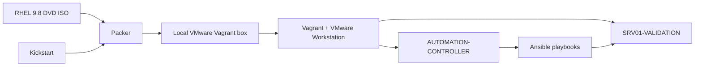

# Validation environment as code

## Objective

Reconstruct a controlled RHEL environment from installation media, validate the
automation modules independently and preserve reproducible evidence before
promotion to production.

This procedure does not reuse, clone or modify an existing production VM.

## Architecture



## Host requirements

- VMware Workstation;
- Packer 1.10 or newer;
- Vagrant 2.4 or newer;
- Vagrant VMware Utility;
- `vagrant-vmware-desktop` provider plugin;
- OpenSSH client with `ssh-keygen`;
- RHEL 9.8 x86_64 DVD ISO with verified SHA-256.

Official references:

- [Packer VMware ISO builder](https://developer.hashicorp.com/packer/integrations/vmware/vmware/latest/components/builder/iso)
- [Packer installation](https://developer.hashicorp.com/packer/install)
- [Vagrant installation](https://developer.hashicorp.com/vagrant/install)
- [Vagrant VMware provider installation](https://developer.hashicorp.com/vagrant/docs/providers/vmware/installation)

## Local-only material

The initialization and validation scripts create:

```text
.validation/
|-- id_ed25519
|-- id_ed25519.pub
|-- vagrant.json
|-- netbox-initial-credentials.txt
`-- ansible/
    |-- hosts.yml
    |-- vault-password.txt
    `-- group_vars/
        `-- all/
            |-- main.yml
            `-- vault.yml

automation/packer/rhel9/local.auto.pkrvars.hcl
```

These files contain local addresses, a private SSH key and a transient build
password. They are ignored by Git and must not appear in screenshots, logs,
commits or support tickets.

Generated RHEL images, Vagrant boxes and VMware disks are also ignored. The
project publishes the build instructions, never Red Hat binaries.

## Execution directories

Run the orchestration scripts from the repository root:

```powershell
Set-Location "D:\OneDrive\04-Projetos-TI\Codex-Labs\infrastructure-operations-platform"
```

Run raw Packer commands only from:

```text
automation\packer\rhel9
```

Run raw Vagrant commands only from:

```text
automation\vagrant
```

## Supervised workflow

### 1. Prepare and certify the Windows workstation

There are two intentionally separate entry points.

The universal bootstrap prepares any Windows infrastructure workstation,
independently of this repository, guest operating system or installation media:

```powershell
.\automation\scripts\Install-InfrastructureWorkstation.ps1 -InstallVmware
```

It provides VMware Workstation, Packer, Vagrant, the VMware provider and,
by default, Ansible in WSL/Ubuntu. Use `-AuditOnly` for a non-mutating
workstation assessment. Use `-SkipVmware` or `-SkipAnsible` for specialized
workstations.

The project wrapper reuses that bootstrap and adds repository and RHEL media
validation:

```powershell
.\automation\scripts\Install-ValidationPrerequisites.ps1
```

This project runs Ansible on `AUTOMATION-CONTROLLER`, so its wrapper does not
require WSL/Ansible on Windows. Neither entry point generates credentials,
builds images or starts VMs.

To perform a read-only recheck:

```powershell
.\automation\scripts\Test-ValidationPrerequisites.ps1
```

### 2. Generate local configuration

Choose two unused addresses from a dedicated host-only validation network:

```powershell
.\automation\scripts\Initialize-Validation.ps1 `
  -ControllerAddress "<CONTROLLER_ADDRESS>" `
  -PlatformAddress "<PLATFORM_ADDRESS>"
```

The script creates a unique SSH key and a cryptographically random transient
password. It never overwrites an existing private key.

### 3. Build the RHEL box

```powershell
.\automation\scripts\Build-RhelBox.ps1
```

The build:

1. verifies the Packer plugins;
2. validates HCL;
3. starts an isolated temporary VMware VM;
4. installs RHEL through Kickstart;
5. validates SSH;
6. shuts down the temporary VM;
7. packages it as a local VMware Vagrant box.

### 4. Register the local box

```powershell
.\automation\scripts\Register-RhelBox.ps1
```

### 5. Create both VMs

```powershell
.\automation\scripts\Start-ValidationEnvironment.ps1
```

Expected resources:

| VM | CPU | RAM | Disk | Purpose |
|---|---:|---:|---:|---|
| `AUTOMATION-CONTROLLER` | 2 | 4 GiB | 60 GiB sparse | Ansible control node |
| `SRV01-VALIDATION` | 4 | 8 GiB | 60 GiB sparse | Platform target |

Both VMs receive NAT connectivity and a dedicated host-only interface. Vagrant
locks the transient password after the first successful key-based connection.

### 6. Run the Ansible preflight

The validation inventory and SSH key remain under `.validation/`. The runner
stages only the ephemeral key, inventory and preflight playbook on
`AUTOMATION-CONTROLLER`, records the platform host key and executes Ansible
from the controller:

```powershell
.\automation\scripts\Run-ValidationPreflight.ps1
```

Expected recap:

```text
ok=5 changed=0 unreachable=0 failed=0
```

### 7. Apply and certify the RHEL baseline

After registering the validation host and enabling the official RHEL BaseOS and
AppStream repositories, stage the baseline role on the controller, install the
pinned compatible collections, apply updates, perform the controlled reboot and
run a second idempotence pass:

```powershell
.\automation\scripts\Run-ValidationBaseline.ps1 -VerifyIdempotence
```

The second pass must report:

```text
changed=0 unreachable=0 failed=0
```

The validation variables keep SSH hardening disabled until its independent
access-recovery test is performed. SELinux enforcing and firewalld remain
enabled.

### 8. Install and certify Docker

Stage the Docker role and validation variables on the controller, install
Docker Engine and the Compose plugin, and perform a second idempotence pass:

```powershell
.\automation\scripts\Run-ValidationDocker.ps1 -VerifyIdempotence
```

Certification requires:

- Docker and containerd active;
- Docker enabled at boot;
- the administrative automation user present in the Docker group;
- valid `/etc/docker/daemon.json`;
- `json-file` rotation and live restore enabled;
- Compose and Buildx plugins available;
- second pass with `changed=0`, `unreachable=0` and `failed=0`;
- no unexpected containers or images before application deployment.

### 9. Deploy and certify NetBox

The NetBox runner generates unique local secrets, encrypts the application
secrets with Ansible Vault, creates the initial administrator and deploys the
complete application stack:

```powershell
.\automation\scripts\Run-ValidationNetBox.ps1 `
  -AdminEmail "<ADMIN_EMAIL>" `
  -VerifyPersistence `
  -VerifyIdempotence
```

The stack contains NetBox, its worker and housekeeping process, PostgreSQL and
two isolated Valkey instances. Persistent data is stored in named Docker
volumes. The web service binds only to `127.0.0.1:8000` on the validation VM;
it is not exposed directly to the host-only network.

Certification requires:

- all services running and every service with a health check reporting healthy;
- `/login/` returning HTTP 200;
- database migrations applied and one initial superuser present;
- persistent volumes present after a controlled VM restart;
- housekeeping process running without a restart loop;
- API token pepper configured;
- final Ansible pass with `changed=0`, `unreachable=0` and `failed=0`.

Open a separate Windows Terminal and keep this SSH tunnel running:

```powershell
ssh -N -L 8000:127.0.0.1:8000 `
  -i ".validation\id_ed25519" `
  automation@<PLATFORM_ADDRESS>
```

Then open `http://127.0.0.1:8000`. Transfer the generated initial password from
`.validation/netbox-initial-credentials.txt` to an approved password manager
and delete the plaintext file after login has been validated.

### 10. Prove NetBox backup and restore

Install the daily systemd timer, create a consistent application backup and
restore its database into a disposable isolated PostgreSQL container:

```powershell
.\automation\scripts\Run-ValidationNetBoxBackup.ps1 `
  -VerifyRestore `
  -VerifyIdempotence
```

Certification requires:

- database dump, media archive, non-secret Compose configuration and metadata;
- a SHA-256 manifest with every checksum valid;
- successful PostgreSQL restore with NetBox migrations present;
- removal of the disposable restore container;
- active and enabled `netbox-backup.timer`;
- second configuration pass with `changed=0`, `unreachable=0` and `failed=0`.

The local backup proves recoverability but is not disaster recovery. Production
promotion also requires encrypted replication to storage outside the platform
host and monitoring of backup age and timer failures.

### 11. Deploy and certify Traefik ingress

Deploy Traefik, its restricted Docker Socket Proxy and a disposable discovery
target:

```powershell
.\automation\scripts\Run-ValidationTraefik.ps1 -VerifyIdempotence
```

Certification requires:

- Traefik and Socket Proxy healthy;
- no direct Docker Socket mount in the Traefik container;
- unauthenticated dashboard request returning HTTP 401;
- Docker-discovered validation route returning HTTP 200;
- reusable security headers present;
- read-only Docker API request accepted through Socket Proxy;
- Docker API mutation rejected with HTTP 403;
- final pass with `changed=0`, `unreachable=0` and `failed=0`.

The runner creates a private validation CA on `AUTOMATION-CONTROLLER`, signs a
certificate for `traefik.localhost` and `whoami.localhost`, and copies only the
public CA certificate to `.validation/traefik-validation-ca.crt`. The CA
private key never leaves the controller.

Open a separate Windows Terminal and keep both tunnels running:

```powershell
ssh -N `
  -L 8080:127.0.0.1:8080 `
  -L 8443:127.0.0.1:8443 `
  -i ".validation\id_ed25519" `
  automation@<PLATFORM_ADDRESS>
```

After explicitly reviewing the certificate, install the public validation CA
in the current user's Windows trust store:

```powershell
Import-Certificate `
  -FilePath ".validation\traefik-validation-ca.crt" `
  -CertStoreLocation "Cert:\CurrentUser\Root"
```

Open `https://traefik.localhost:8443/dashboard/` and use the credential stored
in `.validation/traefik-initial-credentials.txt`. The validation route is
available at `https://whoami.localhost:8443/`. HTTP on port `8080` redirects to
HTTPS on port `8443`.

### 12. Publish NetBox through the validated ingress

After Traefik has created the external `proxy` network, connect NetBox to it
and retain the loopback-only direct binding as a recovery path:

```powershell
.\automation\scripts\Run-ValidationNetBox.ps1 `
  -AdminEmail "<ADMIN_EMAIL>" `
  -EnableTraefik `
  -VerifyIdempotence
```

Open `https://netbox.localhost:8443/`. Certification requires a trusted
certificate containing `netbox.localhost`, HTTP 200 on `/login/`, HSTS and
`X-Content-Type-Options: nosniff`. HTTP port `8080` must redirect the same
hostname to HTTPS. For emergency access, add `-L 8000:127.0.0.1:8000` to the
SSH tunnel and open `http://127.0.0.1:8000`; this fallback never binds to the
host-only network.

### 13. Deploy and publish Zabbix

Deploy the Zabbix 7.4 Server, Nginx frontend and dedicated MySQL 8.4 LTS
database, rotate the default administrator password and publish the frontend
through the validated ingress:

```powershell
.\automation\scripts\Run-ValidationZabbix.ps1 `
  -EnableTraefik `
  -VerifyPersistence `
  -VerifyIdempotence
```

Open `https://zabbix.localhost:8443/` and use the credential stored in
`.validation/zabbix-initial-credentials.txt`. The database remains on an
internal Docker network. The server listener uses a dedicated agent network
and binds only to `127.0.0.1:10051` in validation. The frontend fallback is
`127.0.0.1:8081`; add both ports to an SSH tunnel only when testing those
recovery paths.

Certification requires three healthy containers, successful login with the
managed credential, rejection of the initial default credential, active Server
listener, HTTP 200 through Traefik, reusable security headers and a final
Ansible pass with `changed=0`, `unreachable=0` and `failed=0`.

This private CA exists only for the isolated validation environment. Production
promotion still requires the certificate, DNS and renewal strategy for the
real application domain.

### 14. Deploy and publish Portainer

Deploy Portainer CE LTS, initialize its administrator from Ansible Vault,
connect the local Docker Engine and publish the interface through Traefik:

```powershell
.\automation\scripts\Run-ValidationPortainer.ps1 `
  -EnableTraefik `
  -VerifyPersistence `
  -VerifyIdempotence
```

Open `https://portainer.localhost:8443/` and use the credential stored in
`.validation/portainer-initial-credentials.txt`. The optional fallback remains
limited to `127.0.0.1:9000`; add that port to the SSH tunnel only for recovery
testing. Edge Agent port `8000` is intentionally not published.

Certification requires a healthy Portainer container, successful API
authentication, discovery of the local Docker socket endpoint, HTTP 200
through Traefik, reusable security headers, persisted data after reload and a
final Ansible pass with `changed=0`, `unreachable=0` and `failed=0`.

Portainer is an operational interface. Changes intended to persist as platform
configuration must be implemented in Ansible and Compose and promoted through
the repository workflow.

### 15. Deploy metrics and visualization

Deploy Prometheus, Grafana, Node Exporter and cAdvisor, provision the datasource
and platform dashboard, and publish Grafana through Traefik:

```powershell
.\automation\scripts\Run-ValidationObservability.ps1 `
  -EnableTraefik `
  -VerifyPersistence `
  -VerifyIdempotence
```

Open `https://grafana.localhost:8443/` and use the credential stored in
`.validation/grafana-initial-credentials.txt`. The Prometheus and Grafana
fallbacks remain limited to `127.0.0.1:9090` and `127.0.0.1:3000`.

Certification requires healthy containers, all Prometheus targets in state
`up`, a working provisioned datasource, the dashboard
`Infrastructure Operations — Host & Containers`, HTTP 200 through Traefik,
persisted data after reload and a final Ansible pass with `changed=0`,
`unreachable=0` and `failed=0`.

The workflow also validates the Blackbox Exporter configuration, requires every
configured HTTP probe to report `probe_success=1`, loads the application alert
rules, and verifies the provisioned `Application & TLS Health` dashboard.

### 16. Validate Zabbix backup and isolated restore

After the Zabbix module has been deployed:

```powershell
.\automation\scripts\Run-ValidationZabbixBackup.ps1 `
  -VerifyRestore `
  -VerifyPersistence `
  -VerifyIdempotence
```

The workflow creates a real consistent backup, restores it into a disposable
MySQL container, validates essential Zabbix tables, reloads the platform VM,
checks the persistent timer, verifies the backup again, and completes with an
idempotent Ansible pass.

### 17. Validate Cockpit

```powershell
.\automation\scripts\Run-ValidationCockpit.ps1 `
  -VerifyIdempotence `
  -VerifyPersistence
```

The workflow installs Cockpit natively, keeps SELinux enforcing, checks the
dedicated `9091/tcp` socket, publishes `cockpit.localhost` through Traefik and
confirms that the service remains enabled and healthy after a VM reload.

### 18. Execute an isolated disaster recovery drill

Configure a distinct recovery address and create the third VM:

```powershell
.\automation\scripts\Initialize-Validation.ps1 `
  -ControllerAddress "<CONTROLLER_IP>" `
  -PlatformAddress "<PLATFORM_IP>" `
  -RecoveryAddress "<RECOVERY_IP>"

Set-Location .\automation\vagrant
vagrant up srv01-recovery --no-provision
Set-Location ..\..
```

After completing the required RHEL registration, reconstruct the platform and
restore the latest encrypted external NetBox and Zabbix recovery point:

```powershell
.\automation\scripts\Run-DisasterRecoveryDrill.ps1
```

The workflow is intentionally restricted to `srv01-recovery`. It verifies the
Restic snapshot and backup manifests, replaces both isolated databases,
restores persistent application data and requires HTTP 200 from NetBox and
Zabbix through Traefik HTTPS. The external backup timer is disabled on the
recovery VM. Sanitized evidence is written below `.validation/recovery/` and
must not include credentials, private topology or recovered records.

## Lifecycle commands

From `automation\vagrant`:

```powershell
vagrant status
vagrant ssh automation-controller
vagrant ssh srv01-validation
vagrant halt
vagrant up
```

Destruction is intentionally excluded from the standard workflow. It must only
be used after verifying the exact Vagrant environment and preserving required
evidence.

## Promotion criteria

The environment is not considered validated until:

- Packer produces the box from a clean run;
- both VMs start from code;
- controller reaches the platform through SSH;
- Ansible preflight succeeds;
- RHEL baseline is idempotent;
- Docker installation is idempotent;
- NetBox survives restart and container recreation;
- NetBox backup restores in an isolated database;
- Zabbix backup restores in an isolated database and its timer survives reload;
- NetBox and Zabbix restore from encrypted external storage in the isolated
  recovery VM and return HTTP 200 through Traefik;
- Cockpit remains enabled, healthy and reachable through Traefik after reload;
- Traefik discovery, authentication and Socket Proxy restrictions pass;
- NetBox responds through Traefik with TLS and reusable security headers;
- Zabbix persists its database, rejects the default credential and is idempotent;
- no local secret or RHEL artifact appears in Git.
